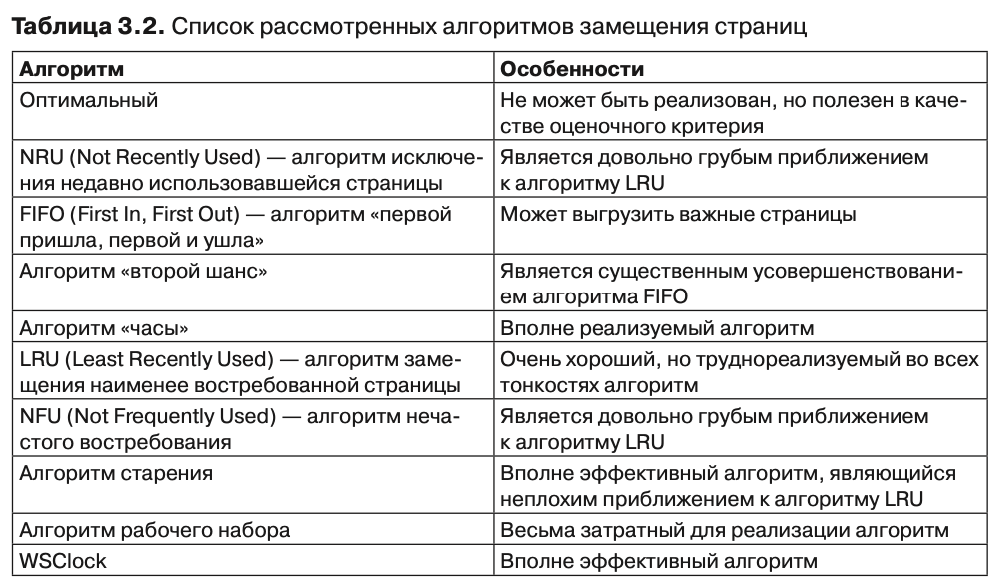

# Алгоритмы замещения страниц виртуальной памяти

При возникновении ошибки отсутствия страници ОС должна выбрать удаляемую из памяти страницу чтобы освободить место для загружаемой. Если удаляема страница за время существования изменилась, требуется актуализировать ее копию на диске.

*Должна ли быть выбрана для удаления страница из списка тех, которые принадлежат процессу в ходе работы которого произошла ошибка отсутствия страници?*

Для повышения производительности выбираться должны наименее часто используемые страници, иначе они постоянно будут курсировать между диском и памятью.

## Оптимальный алгоритм замещения страниц
Отпимальный алгоритм подразумевает что каждая страница имеет пометку с количеством команд, после выполнения которых произойдет обращение к этой странице. Должна быть удалена страница с наибольшей пометкой, т.е. к этой странице обратятся через наибольший промежуток времени. Очевидно что такой алгоритм реализовать не представляется возможным.
Можно лишь провести прогон для конкретной программы, с конкретными входными данными, и на второй прогон программы будет известно какие страници наиболее оптимальны для удаления.

## Алгоритм исключения недавно использовавшейся страницы (NRU - Not Recently Used)
Большинство компьютеров с виртуальной памятью имеют биты R и M (read, modification)
R выставляется при каждом обращении к (чтение или запись), M устанавливается когда в страницу что-то пишут.
Бит R периодически сбрасывается. Так, можно найти страницу к которой в последнее время небыло обращений.
Все 4 варианта значений этих двух бит образуют 4 класса страниц. От тех, к которым небыло обращений / модификаций, до тех, у которых в последнее время были и обращения и модификации.
Алгоритм NRU удаляет произвольную страницу из наименьшего класса.

Является грубым приближением алгоритма LRU.

## Алгоритм замещения наименее востребованной страницы (LRU – Least Recently Used)
Существует наблюдение, что часто используемые страници в рамках нескольких последних команд – скорее всего будут и дальше часто использоваться. Аналогично это работает и для редко используемых страниц. Алгоритм при возникновении ошибки удаляет ту, которая наименее востребована.

Реализация данного алгоритма достаточно сложна, один из вариантов:
На уровне аппаратного обеспечения заводится 64 разрядный счетчик комманд. 
В таблице страниц для каждой страници имеется поле для значения этого счетчика.
При возникновении ошибки отсутствия страници из таблици выбирается страница с наименьшим значением счетчика, т.е. обращение произошло максимально давно.

## Алгоритм «первой пришла, первой и ушла»
<!-- todo -->

## Алгоритм «второй шанс»
<!-- todo -->

## Алгоритм «часы»
<!-- todo -->

## Алгоритм «рабочий набор»
<!-- todo -->

## Сводная табличка адгоритмов

&nbsp;

Источники:
Таненбаум 3.4. Алгоритмы замещения страниц

&nbsp;

> [Список вопросов](Вопросы_ТПП.md)